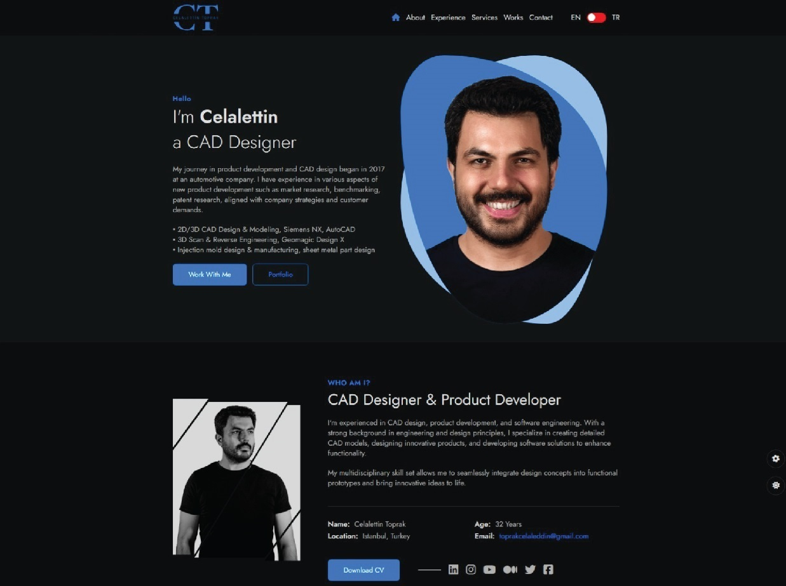
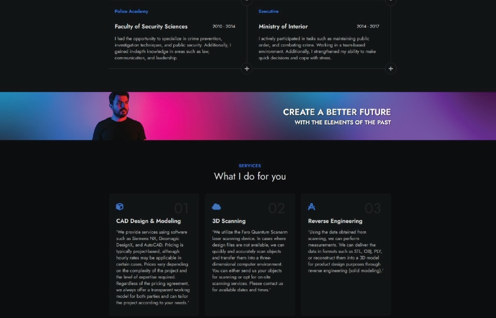
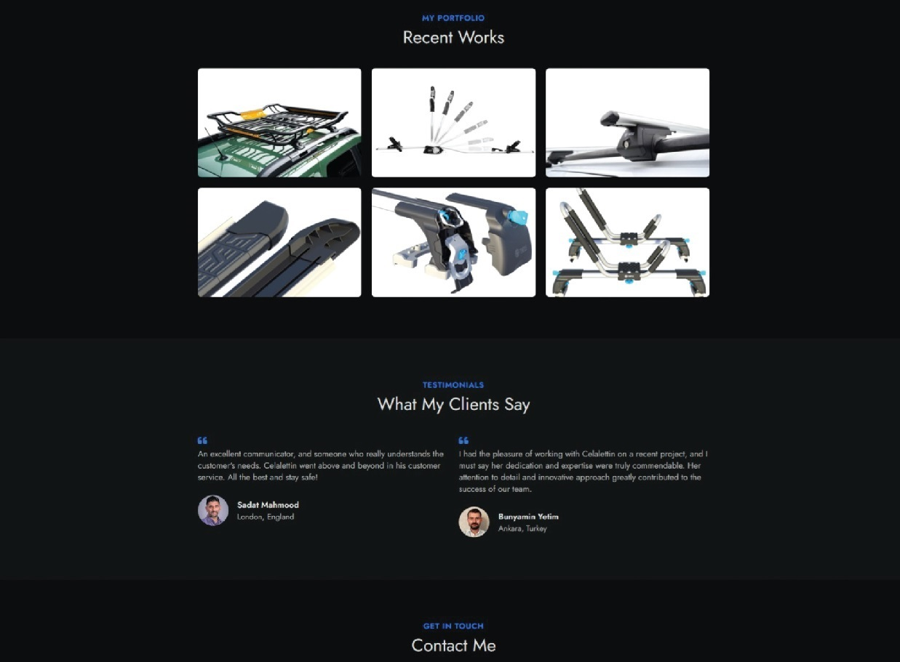

### Hi there, I'm [Celalettin Toprak](https://www.celalettintoprak.com/).  

A Software Engineer & 3D CAD Designer, living in Istanbul!

Celalettin, sometimes people call me Celal. I am a tech enthusiast & an open-source advocate. Always open to collaborating on projects and innovative ideas.

<section style="height:250px; columns: 3; gap: 10px;">
    
    
    
</section>

- 💼 any freelance work? do reach, [email](mailto:toprakcelaleddin@gmail.com) :)
- 💬 ask me about anything, i am happy to help;

### 📫 How to reach me:

 

 

### 📋 Languages & ML/DL & ORM

 

### 📚 Frameworks, Platforms and Libraries

### 💾 Databases

### 🕓 Version Control & 📂 Cloud Storage & ☁️ Hosting/SaaS

### 🎨 Design

 

<!--
**celalettintoprak/celalettintoprak** is a ✨ _special_ ✨ repository because its `README.md` (this file) appears on your GitHub profile.

Here are some ideas to get you started:

- 🔭 I’m currently working on ...
- 🌱 I’m currently learning ...
- 👯 I’m looking to collaborate on ...
- 🤔 I’m looking for help with ...
- 💬 Ask me about ...
- 📫 How to reach me: ...
- 😄 Pronouns: ...
- ⚡ Fun fact: ...
-->
